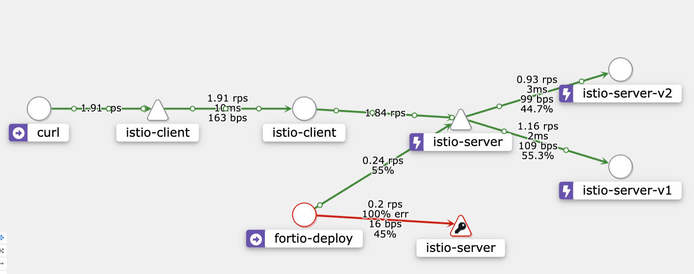
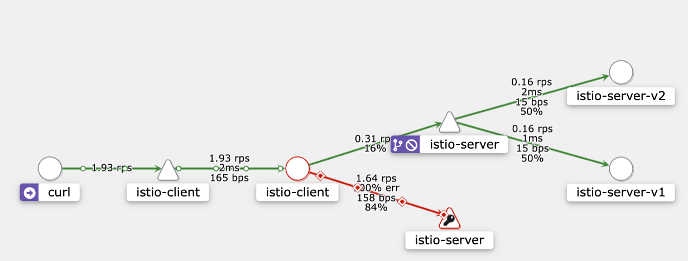
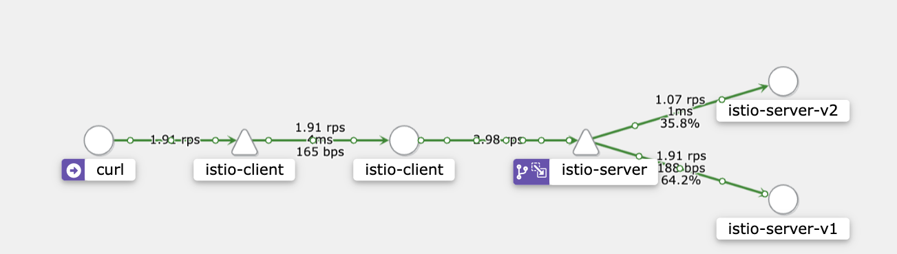
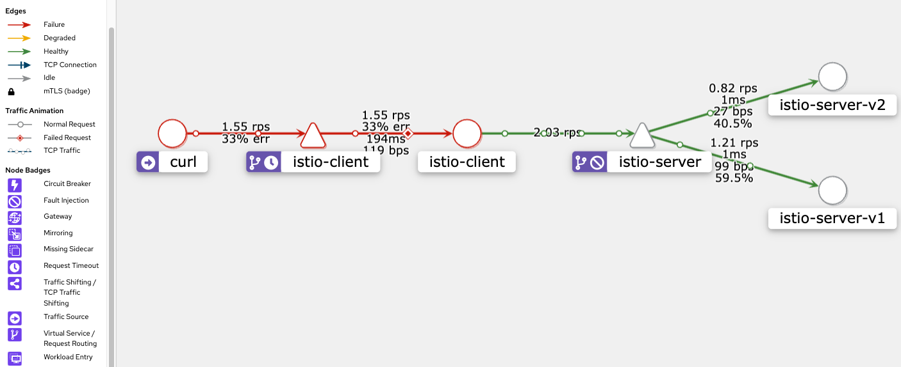
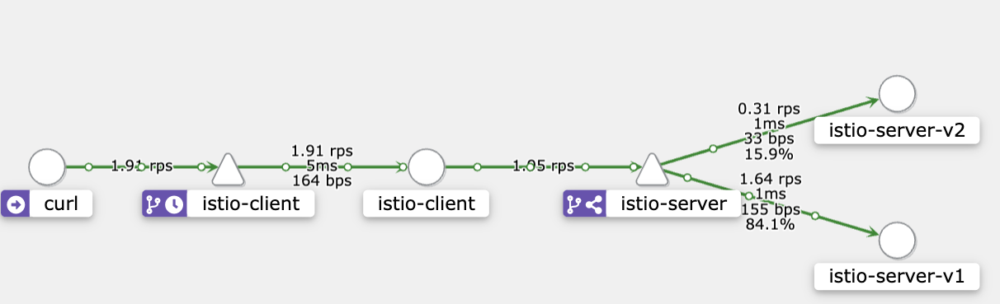
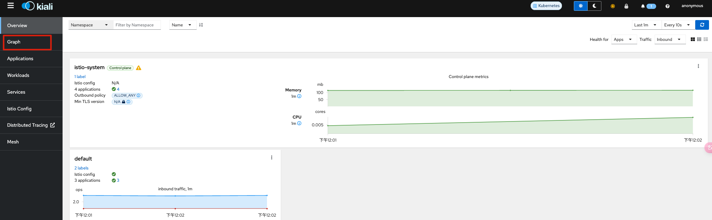

<<<<<<< HEAD
# istio
service mesh
=======
# 前置作業

- 下載istio
    
    ```bash
    curl -L https://istio.io/downloadIstio | sh -
    ```
    
- 到 Istio 目錄 如果是 `istio-1.21.0`
    
    ```bash
    cd istio-1.21.0
    ```
    
    安装目錄包含：
    
    - `bin/` 目录下的 `[istioctl](https://istio.io/latest/zh/docs/reference/commands/istioctl)` 客户端二进制文件。
    - `samples/` 目录下的示例应用程序
- 將 `istioctl` `export`
    
    ```bash
    export PATH=$PWD/bin:$PATH
    ```
    

# 安裝istio

- 安裝istio
    
    ```bash
    istioctl install --set profile=demo -y
    ```
    
    > *✔ Istio core installed
    ✔ Istiod installed
    ✔ Egress gateways installed
    ✔ Ingress gateways installed
    ✔ Installation complete*
    > 
- 给ns添加lable，指示 Istio 在部署application的時候，自動注入 Envoy sidecar
    
    ```bash
    kubectl label namespace <your namespeace> istio-injection=enabled
    ```
    
    ```bash
    kubectl label namespace default istio-injection=enabled
    ```
    
    > *namespace/default labeled*
    > 

# 安裝 Kiali

- 安裝Kiali 跟其他套件
    - 安裝Kiali 同時也必須要安裝prometheus，Kiali所呈現的圖 事先透過prometheus
        
        ```bash
        cd istio-1.21.0/samples/addons
        ```
        
        - 可以只安裝 或先全裝
        
        ```bash
        kubectl apply -f kiali.yaml
        kubectl apply -f . prometheus.yaml
        ```
        
        
        

# 安裝 application

1. istio-client
    
    ```bash
    apiVersion: apps/v1
    kind: Deployment
    metadata:
      name: istio-client
    spec:
      replicas: 1
      selector:
        matchLabels:
          app: istio-client
      template:
        metadata:
          labels:
            app: istio-client
        spec:
          containers:
            - name: istio-client
              image: ethan510010/istio-client:v1.0
              ports:
                - containerPort: 3000
              env:
                - name: SERVER_HOST
                  value: "istio-server"
                - name: SERVER_PORT
                  value: "5000"
    ---
    apiVersion: v1
    kind: Service
    metadata:
      name: istio-client
    spec:
      type: ClusterIP
      selector:
        app: istio-client
      ports:
      - name: http-3000 # 端口名加上了http前綴
        port: 3000
        targetPort: 3000
    ```
    
2. istio-server
    
    ```bash
    apiVersion: apps/v1
    kind: Deployment
    metadata:
      name: istio-server-v1
    spec:
      replicas: 1
      selector:
        matchLabels:
          app: istio-server
          version: v1
      template:
        metadata:
          labels:
            app: istio-server
            version: v1
        spec:
          containers:
            - name: istio-server
              image: ethan510010/istio-server:v1.0
              imagePullPolicy: Always
              ports:
                - containerPort: 5000
    ---
    apiVersion: apps/v1
    kind: Deployment
    metadata:
      name: istio-server-v2
    spec:
      replicas: 1
      selector:
        matchLabels:
          app: istio-server
          version: v2
      template:
        metadata:
          labels:
            app: istio-server
            version: v2
        spec:
          containers:
            - name: istio-server
              image: ethan510010/istio-server:v2.0
              imagePullPolicy: Always
              ports:
                - containerPort: 5000
    ---
    apiVersion: v1
    kind: Service
    metadata:
      name: istio-server
    spec:
      type: ClusterIP
      selector:
        app: istio-server
      ports:
        - name: http-5000  # 端口名加上了http前綴
          port: 5000
          targetPort: 5000
    ```
    
3. 可能發生的問題 彙整
    - 如果你app先裝，後裝istio，會沒有sidecar
    需要restart你的dp，這時候你的pod，才會有3個container
        
        
        
    - selector 內的 key vaule ，只能是 app : 任意的vaules
    - ports:
        - name: http-5000  # 端口名加上了http前綴

# Demo 5題

1. circuit-breaker.yaml
    
    
    
    ```bash
    apiVersion: v1
    kind: Service
    metadata:
      name: fortio
      labels:
        app: fortio
        service: fortio
    spec:
      ports:
      - port: 8080
        name: http
      selector:
        app: fortio
    ---
    apiVersion: apps/v1
    kind: Deployment
    metadata:
      name: fortio-deploy
    spec:
      replicas: 1
      selector:
        matchLabels:
          app: fortio
      template:
        metadata:
          annotations:
            # This annotation causes Envoy to serve cluster.outbound statistics via 15000/stats
            # in addition to the stats normally served by Istio. The Circuit Breaking example task
            # gives an example of inspecting Envoy stats via proxy config.
            proxy.istio.io/config: |-
              proxyStatsMatcher:
                inclusionPrefixes:
                - "cluster.outbound"
                - "cluster_manager"
                - "listener_manager"
                - "server"
                - "cluster.xds-grpc"
          labels:
            app: fortio
        spec:
          containers:
          - name: fortio
            image: fortio/fortio:latest_release
            imagePullPolicy: Always
            ports:
            - containerPort: 8080
              name: http-fortio
            - containerPort: 8079
              name: grpc-ping
    ---
    apiVersion: networking.istio.io/v1alpha3
    kind: DestinationRule
    metadata:
      name: istio-server
    spec:
      host: istio-server
      trafficPolicy:
        connectionPool:
          tcp:
            maxConnections: 1
          http:
            http1MaxPendingRequests: 1
            maxRequestsPerConnection: 1
        outlierDetection:
          consecutive5xxErrors: 1
          interval: 1s
          baseEjectionTime: 3m
          maxEjectionPercent: 100
    ```
    
2. fault-injection.yml
    
    
    
    ```bash
    apiVersion: networking.istio.io/v1alpha3
    kind: VirtualService
    metadata:
      name: istio-server
    spec:
      hosts:
        - istio-server
      http:
      - fault:
          abort:
            percentage:
              value: 80.0
            httpStatus: 500
        route:
        - destination:
            host: istio-server
    
    ```
    
3. mirror.yaml
    
    
    
    ```bash
    apiVersion: networking.istio.io/v1alpha3
    kind: VirtualService
    metadata:
      name: istio-server
    spec:
      hosts:
        - istio-server
      http:
      - route:
          - destination:
              host: istio-server
              subset: v1
            weight: 100
        mirror:
          host: istio-server
          subset: v2
        mirrorPercentage: 
          value: 50
    
    ---
    apiVersion: networking.istio.io/v1alpha3
    kind: DestinationRule
    metadata:
      name: istio-server
    spec:
      host: istio-server
      subsets:
      - name: v1
        labels:
          version: v1
      - name: v2
        labels:
          version: v2
    ```
    
4. request_timeout.yaml
    
    
    
    ```bash
    apiVersion: networking.istio.io/v1alpha3
    kind: VirtualService
    metadata:
      name: istio-server
    spec:
      hosts:
      - istio-server
      http:
      - fault:
          delay:
            percentage:
              value: 50
            fixedDelay: 5s
        route:
          - destination:
              host: istio-server
    ---
    apiVersion: networking.istio.io/v1alpha3
    kind: VirtualService
    metadata:
      name: istio-client
    spec:
      hosts:
      - istio-client
      http:
      - route:
        - destination:
            host: istio-client
        timeout: 1s
    ```
    
5. traffic-shifting.yml
    
    
    ```bash
    apiVersion: networking.istio.io/v1alpha3
    kind: VirtualService
    metadata:
      name: istio-server
    spec:
      hosts:
        - istio-server
      http:
      - route:
        - destination:
            host: istio-server
            subset: v1
          weight: 80
        - destination:
            host: istio-server
            subset: v2
          weight: 20
    ---
    apiVersion: networking.istio.io/v1alpha3
    kind: DestinationRule
    metadata:
      name: istio-server
    spec:
      host: istio-server
      subsets:
      - name: v1
        labels:
          version: v1
      - name: v2
        labels:
          version: v2
    ```
    

# 測試方式

1. 起一個 測試的curl pod
    
    ```bash
    kubectl run curl --image=curlimages/curl -it -- sh
    ```
    
2. exec到curl pod， 寫一個簡單的的腳本 讓他一直打istio
    
    ```bash
    vi test.sh
    chmod +x test.sh
    ```
    
    - test.sh 內容
        
        ```bash
        #!/bin/sh
        
        while true
         do
            curl http://istio-client:3000/hello -w '\n'
            sleep 0.5
        done
        ```
        
3. 開啟 Kiali
    
    ```bash
    cd /istio-1.21.0/bin
    ./istioctl dashboard kiali
    ```
    
    
    
4. 選擇到 graph  可以看到即時的流量圖
5. circuit-breaker 的測試方式
    
    ```bash
    export FORTIO_POD=$(kubectl get pods -l app=fortio -o 'jsonpath={.items[0].metadata.name}')
    
    kubectl exec "$FORTIO_POD" -c fortio -- /usr/bin/fortio load -c 2 -qps 0 -n 20 -loglevel Warning http://istio-server:5000
    ```
    
6. 其餘apply yaml 即可達成
>>>>>>> 1eb67f5 ([Update] add demo & readme)
